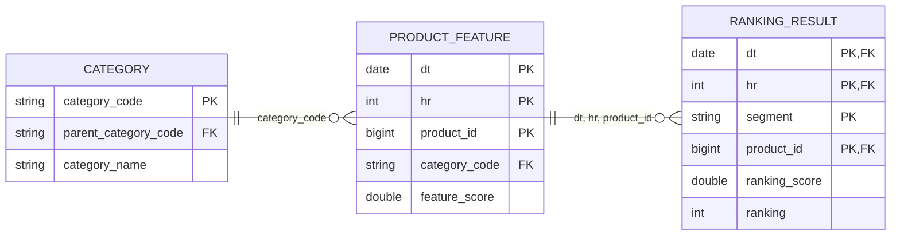
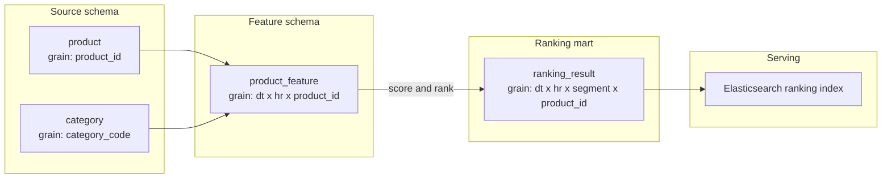

---
paths:
  - "docs/**/*.md"
---

# 데이터 모델링 문서 규칙

랭킹 입력, 중간 피처, 최종 산출물 또는 서빙 저장소의 관계를 문서화할 때는
Markdown 안에 Mermaid를 사용한다. 다이어그램 이미지만 첨부하지 말고, 리뷰 가능한
Mermaid 원본을 문서의 기준으로 유지한다.

## 필수 구성

데이터 모델 문서는 아래 세 요소를 순서대로 포함한다.

1. **모델 계약 표**: 물리 schema/table, 한 행의 grain, 키, 파티션, 갱신 방식을 명시한다.
2. **논리 또는 물리 ERD**: Mermaid `erDiagram`으로 entity, attribute, relationship,
   cardinality를 표현한다.
3. **데이터 리니지**: Mermaid `flowchart LR`로 입력에서 변환, 산출물, 서빙까지의
   데이터 이동 방향을 표현한다.

ERD와 리니지를 하나의 그림에 섞지 않는다. ERD의 선은 참조 관계이고, 리니지의
화살표는 배치가 데이터를 읽고 생성하는 방향이다.

## 모델 계약 표

각 entity 또는 물리 테이블에 대해 다음 항목을 작성한다.

| 항목 | 작성 규칙 |
|---|---|
| 물리 위치 | catalog와 schema를 포함한 전체 이름을 쓴다. 예: `iceberg.ranking_iceberg_stage.table_name` |
| Grain | "한 행 = 무엇"인지 정확히 쓴다. 예: `(dt, hr, product_id)`별 상품 스냅샷 1건 |
| Key | 실제 PK/UK인지 분석용 후보 키인지 구분한다. 복합키는 구성 컬럼을 모두 쓴다. |
| Partition | 파티션 컬럼과 저장 방식을 쓴다. 파티션 키를 business key와 동일시하지 않는다. |
| Update | append, partition overwrite, merge/upsert, SCD1, SCD2 중 실제 방식을 쓴다. |
| 역할 | 원천, 중간 피처, 랭킹 결과, export, serving 중 역할을 쓴다. |

환경별 schema를 `{phase}` 같은 자리표시자로 줄여 쓰면 `prod`, `stage`, `dev`에서의
실제 이름 또는 변환 규칙을 표 아래에 설명한다.

## Mermaid ERD 규칙

- 코드 블록은 반드시 ` ```mermaid `로 시작하고 `erDiagram`을 사용한다.
- 방향은 관계를 읽기 쉽게 `direction LR` 또는 `direction TB`로 명시한다.
- attribute에는 데이터 타입과 `PK`, `FK`, `UK`를 표시한다.
- 복합 grain을 구성하는 컬럼에는 모두 `PK`를 표시한다.
- 관계에는 `||`, `o|`, `|{`, `o{`로 최소/최대 cardinality를 표시한다.
- 관계 라벨에는 일반 설명보다 실제 조인 키 또는 관계 역할을 쓴다.
- 문서에 필요한 키, 조인, 파티션, 시간, 핵심 지표 컬럼만 표시한다. 전체 DDL을
  그대로 복제하지 않는다.
- 논리 모델의 `PK`/`FK`가 Iceberg, Hive, ES, Redis 등에 실제 선언된 제약이 아니라면
  다이어그램 앞에 "분석용 논리 키"라고 명시한다.
- 시간 가변 데이터는 `valid_from`, `valid_to`, `is_current` 또는 `dt`, `hr` 등
  point-in-time 조인에 필요한 컬럼을 생략하지 않는다.
- Mermaid 버전 호환성을 위해 ERD 내부 schema grouping에 의존하지 않는다. schema와
  저장소 경계는 모델 계약 표와 별도 리니지에서 표현한다.

## Mermaid 리니지 규칙

- `flowchart LR`을 기본 방향으로 사용한다.
- catalog, schema 또는 저장소별로 `subgraph`를 나눈다.
- 노드에는 물리 테이블명과 grain을 함께 표시한다.
- 화살표는 항상 `입력 -> 변환/중간 산출물 -> 최종 산출물 -> serving` 방향으로 그린다.
- 필터, 집계, 정규화, 후보 생성, 점수 계산처럼 결과 의미를 바꾸는 변환은 독립 노드나
  화살표 라벨로 표시한다.
- 배치 의존성과 FK 관계를 혼동하지 않는다. 조인 조건은 ERD 또는 모델 계약 표에 쓴다.
- 서로 다른 시점의 파티션을 읽는 경우 `latest`, `dt/hr`, lookback 범위를 노드 또는
  문장으로 명시한다.

## 기본 템플릿

````markdown
## 모델 계약

| Entity | Physical schema/table | Grain | Key | Partition / Update | 역할 |
|---|---|---|---|---|---|
| 상품 피처 | `iceberg.ranking_iceberg_{phase}.product_feature` | 한 행 = `(dt, hr, product_id)`별 상품 스냅샷 1건 | 분석용 후보 키 `(dt, hr, product_id)` | `dt`, `hr` partition overwrite | 중간 피처 |
| 랭킹 결과 | `iceberg.ranking_iceberg_{phase}.ranking_result` | 한 행 = `(dt, hr, segment, product_id)`별 점수 1건 | 분석용 후보 키 `(dt, hr, segment, product_id)` | `dt`, `hr` partition overwrite | 최종 산출물 |

> 아래 PK/FK는 관계를 설명하는 분석용 논리 키이며 물리 저장소에 선언된 제약을 뜻하지 않는다.

## 논리 ERD



## 데이터 리니지


````

## 가독성과 유지보수

- 한 ERD에 entity가 12개를 넘으면 도메인 또는 처리 단계별로 분리한다.
- 상위 문서에는 전체 리니지를 두고, 상세 문서에는 도메인별 ERD를 둔다.
- entity와 컬럼명은 실제 코드/DDL 명칭을 우선하고, 한글 설명은 표와 라벨로 보완한다.
- 관계 또는 grain을 코드에서 확인하지 못한 경우 추정하지 말고 `미확인`으로 표시한다.
- 모델 변경 시 입력, grain, 조인 키, cardinality, 파티션, 하류 산출물 영향을 함께 갱신한다.
- Mermaid가 GitHub Enterprise와 Obsidian 양쪽에서 렌더링되는지 확인한다. 최신 문법을
  사용할 때는 대상 환경의 Mermaid 버전을 먼저 확인한다.
