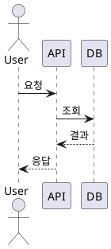
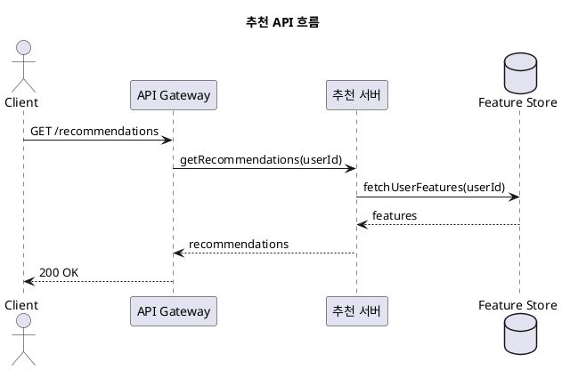
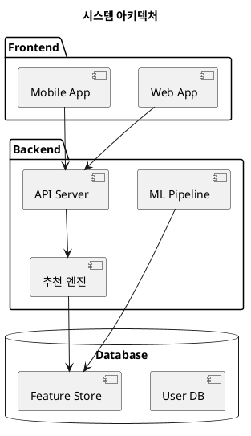

# wiki-manager

카카오 온프레미스 Confluence 위키(https://wiki.daumkakao.com)를 관리하는 스킬입니다.

## 환경 설정

`.env` 파일에 다음 환경변수가 필요합니다:
```
WIKI_BASE_URL=https://wiki.daumkakao.com
WIKI_TOKEN=your_personal_access_token
```

Personal Access Token은 위키 사용자 설정 > 개인 액세스 토큰에서 발급받습니다.

---

## 대표 위키 공간

| 공간 키 | 이름 | 설명 |
|---------|------|------|
| `KCAI` | 커머스추천팀 | 우리팀 메인 공간. 프로덕트, 프로젝트, 가이드 문서 |
| `developerguide` | Kakao DevGuide | 카카오 전사 개발 가이드 및 API 연동 문서 |
| `CommerceDataEngineeringTeam` | 커머스데이터엔지니어링팀 (CDE 팀) | MLOps, 서빙, 데이터엔지니어링 지원팀 문서 |

---

## 워크플로우

### 1. 페이지 읽기

사용자가 위키 페이지 내용을 요청할 때:

1. 페이지 ID 또는 URL 확인
   - URL인 경우 페이지 ID 추출: `parse-url` 명령 사용
   - 예: `https://wiki.daumkakao.com/spaces/KCAI/pages/815966617/...` → `815966617`

2. 페이지 조회
   ```bash
   # JSON 형식 (메타데이터 포함)
   uv run python .claude/skills/wiki-manager/scripts/wiki_client.py read --page-id {ID} --format json

   # Markdown 형식 (읽기 쉬운 형식)
   uv run python .claude/skills/wiki-manager/scripts/wiki_client.py read --page-id {ID} --format markdown

   # URL로 직접 조회
   uv run python .claude/skills/wiki-manager/scripts/wiki_client.py read --url "{URL}" --format markdown
   ```

3. 결과 제공
   - Markdown 형식으로 변환하여 사용자에게 보여주기
   - 필요시 특정 섹션만 추출하여 제공

### 2. 페이지 검색

사용자가 특정 페이지를 찾고자 할 때:

1. 검색 방법 선택
   - **CQL 검색** (권장): 유연한 검색
   - **제목 검색**: 정확한 제목 매칭
   - **하위 페이지**: 특정 페이지의 자식 목록
   - **상위 페이지**: 페이지의 부모 경로 (breadcrumb)

2. CQL 검색 실행
   ```bash
   # 특정 공간에서 검색 (사용자가 공간을 지정한 경우)
   uv run python .claude/skills/wiki-manager/scripts/wiki_client.py cql 'space = KCAI and title ~ "검색어"'

   # 전체 공간에서 검색 (공간 지정 없는 경우)
   uv run python .claude/skills/wiki-manager/scripts/wiki_client.py cql 'title ~ "검색어"'

   # 본문에 키워드 포함
   uv run python .claude/skills/wiki-manager/scripts/wiki_client.py cql 'text ~ "검색어"'

   # 특정 부모 페이지 아래 검색
   uv run python .claude/skills/wiki-manager/scripts/wiki_client.py cql 'parent = 815966617'
   ```

   > **주의**: `space = KCAI` 조건은 사용자가 명시적으로 우리팀/특정 공간을 요청할 때만 추가.
   > 맥락에 따라 다른 공간이나 전체 검색이 필요할 수 있음.

3. 하위/상위 페이지 탐색
   ```bash
   # 하위 페이지 목록
   uv run python .claude/skills/wiki-manager/scripts/wiki_client.py children --page-id {PARENT_ID}

   # 상위 페이지 경로 (breadcrumb)
   uv run python .claude/skills/wiki-manager/scripts/wiki_client.py ancestors --page-id {PAGE_ID}
   ```

4. 결과 정리하여 사용자에게 제공

### 3. 페이지 생성

사용자가 새 페이지 생성을 요청할 때:

> **기본 규칙**:
> - 공간을 지정하지 않으면 **KCAI** 공간에 생성
> - **반드시 적절한 상위 페이지(parent-id) 지정** - 지정하지 않으면 공간 루트에 생성되어 페이지 트리에서 찾기 어려움

1. 필수 정보 확인
   - 공간 키 (기본: `KCAI`)
   - 페이지 제목
   - **부모 페이지 ID** (필수로 확인)
   - 페이지 내용 (Markdown)

2. 적절한 상위 페이지 찾기
   ```bash
   # 상위 페이지 후보 검색
   uv run python .claude/skills/wiki-manager/scripts/wiki_client.py children --page-id 815966617

   # 또는 CQL로 검색
   uv run python .claude/skills/wiki-manager/scripts/wiki_client.py cql 'space = KCAI and title ~ "Projects"'
   ```

3. **Dry-run으로 미리보기**
   ```bash
   uv run python .claude/skills/wiki-manager/scripts/wiki_client.py --dry-run create \
     --space KCAI \
     --title "새 페이지 제목" \
     --parent-id {PARENT_ID}
   ```

4. 사용자 확인 후 실제 생성
   ```bash
   # 본문 파일 준비 후
   uv run python .claude/skills/wiki-manager/scripts/wiki_client.py create \
     --space KCAI \
     --title "새 페이지 제목" \
     --parent-id {PARENT_ID} \
     --body-file content.md
   ```

5. 생성된 페이지 URL 제공

### 4. 페이지 수정

사용자가 기존 페이지 수정을 요청할 때:

1. 현재 페이지 내용 조회
   ```bash
   uv run python .claude/skills/wiki-manager/scripts/wiki_client.py read --page-id {ID} --format markdown
   ```

2. 수정할 내용을 Markdown 파일로 준비

3. **Dry-run으로 미리보기**
   ```bash
   uv run python .claude/skills/wiki-manager/scripts/wiki_client.py --dry-run update \
     --page-id {ID} \
     --body-file updated_content.md
   ```

4. 사용자 확인 후 실제 수정
   ```bash
   uv run python .claude/skills/wiki-manager/scripts/wiki_client.py update \
     --page-id {ID} \
     --body-file updated_content.md
   ```

### 5. 페이지 삭제

사용자가 페이지 삭제를 요청할 때:

1. 삭제 대상 페이지 확인
   ```bash
   uv run python .claude/skills/wiki-manager/scripts/wiki_client.py read --page-id {ID} --format json
   ```

2. **반드시 사용자에게 확인 요청**
   - 페이지 제목, 버전, 마지막 수정자 정보 제공
   - 하위 페이지 존재 여부 확인

3. **Dry-run으로 미리보기**
   ```bash
   uv run python .claude/skills/wiki-manager/scripts/wiki_client.py --dry-run delete --page-id {ID}
   ```

4. 사용자 최종 확인 후 삭제
   ```bash
   uv run python .claude/skills/wiki-manager/scripts/wiki_client.py delete --page-id {ID}
   ```

---

## 주요 팀 페이지 (KCAI)

| 페이지 | ID | 설명 |
|--------|-----|------|
| 커머스추천팀 Home | 815966617 | 팀 대문 페이지 |
| [Products] 추천 | 1892187086 | 프로덕트 문서 |

> 추가 페이지는 `references/space-structure.md`에서 관리 예정

---

## 참고 자료

- **API 특이사항**: `references/api-notes.md`
- **위키 구조**: `references/space-structure.md` (작성 예정)

## CLI 명령어 요약

### 기본 명령

| 명령 | 설명 |
|------|------|
| `read --page-id ID` | 페이지 읽기 |
| `read --url URL` | URL로 페이지 읽기 |
| `cql 'QUERY'` | CQL 검색 |
| `search --space KEY --title TITLE` | 제목 검색 |
| `children --page-id ID` | 하위 페이지 목록 |
| `ancestors --page-id ID` | 상위 페이지 경로 (breadcrumb) |
| `create --space KEY --title TITLE` | 페이지 생성 |
| `update --page-id ID --body-file FILE` | 페이지 수정 |
| `delete --page-id ID` | 페이지 삭제 |
| `parse-url URL` | URL에서 페이지 ID 추출 |

### 라벨 관리

| 명령 | 설명 |
|------|------|
| `labels --page-id ID` | 페이지 라벨 목록 조회 |
| `add-label --page-id ID --label NAME` | 라벨 추가 |
| `remove-label --page-id ID --label NAME` | 라벨 삭제 |

### 버전 히스토리

| 명령 | 설명 |
|------|------|
| `history --page-id ID` | 버전 히스토리 조회 |
| `version --page-id ID --version N` | 특정 버전 내용 조회 |

### 첨부파일

| 명령 | 설명 |
|------|------|
| `attachments --page-id ID` | 첨부파일 목록 조회 |
| `upload --page-id ID --file PATH` | 첨부파일 업로드 |
| `download --page-id ID --attachment-id AID --output PATH` | 첨부파일 다운로드 |

### 댓글

| 명령 | 설명 |
|------|------|
| `comments --page-id ID` | 댓글 목록 조회 |
| `add-comment --page-id ID --body TEXT` | 댓글 추가 |

### 페이지 복사/이동

| 명령 | 설명 |
|------|------|
| `copy --page-id ID --dest-page-id DEST_ID` | 페이지 복사 |
| `move --page-id ID --target-page-id TARGET_ID` | 페이지 이동 |

### 공간 정보

| 명령 | 설명 |
|------|------|
| `space SPACE_KEY` | 공간 정보 조회 |
| `watchers --page-id ID` | 페이지 워처 목록 조회 |

모든 쓰기 명령에 `--dry-run` 옵션을 추가하면 실제 변경 없이 미리보기를 볼 수 있습니다.

---

## PlantUML 다이어그램

### 지원 형식

Markdown 파일에서 ` ```plantuml ` 코드 블록을 사용하면 자동으로 Confluence PlantUML 매크로로 변환됩니다.

```markdown
# API 흐름도



### 다이어그램 유형

| 유형 | 설명 | 시작 태그 |
|------|------|-----------|
| 시퀀스 다이어그램 | API 호출 흐름, 시스템 간 통신 | `@startuml` |
| 클래스 다이어그램 | 객체 관계, 데이터 모델 | `@startuml` |
| 컴포넌트 다이어그램 | 시스템 아키텍처 | `@startuml` |
| 액티비티 다이어그램 | 워크플로우, 비즈니스 프로세스 | `@startuml` |
| 마인드맵 | 브레인스토밍, 개요 | `@startmindmap` |
| JSON/YAML 시각화 | 데이터 구조 | `@startjson` / `@startyaml` |

### 예시: 시퀀스 다이어그램



### 예시: 컴포넌트 다이어그램



### 워크플로우

1. **Markdown 파일 작성**: ` ```plantuml ` 코드 블록 포함
2. **페이지 생성/수정**: wiki-manager가 자동으로 매크로 변환
   ```bash
   uv run python .claude/skills/wiki-manager/scripts/wiki_client.py create \
     --space KCAI \
     --title "시스템 아키텍처" \
     --parent-id {PARENT_ID} \
     --body-file architecture.md
   ```
3. **결과 확인**: Confluence에서 렌더링된 다이어그램 확인

### 역변환

Confluence 페이지를 Markdown으로 읽을 때 PlantUML 매크로는 자동으로 ` ```plantuml ` 코드 블록으로 변환됩니다.

```bash
# Markdown으로 읽기
uv run python .claude/skills/wiki-manager/scripts/wiki_client.py read --page-id {ID} --format markdown
```

---

## 추가 워크플로우

### 6. 라벨 관리

페이지에 라벨을 추가하거나 조회할 때:

```bash
# 라벨 조회
uv run python .claude/skills/wiki-manager/scripts/wiki_client.py labels --page-id {ID}

# 라벨 추가
uv run python .claude/skills/wiki-manager/scripts/wiki_client.py add-label --page-id {ID} --label "my-label"

# 라벨 삭제
uv run python .claude/skills/wiki-manager/scripts/wiki_client.py remove-label --page-id {ID} --label "my-label"
```

### 7. 버전 히스토리

페이지 수정 이력을 확인하거나 특정 버전을 조회할 때:

```bash
# 히스토리 조회 (최근 10개)
uv run python .claude/skills/wiki-manager/scripts/wiki_client.py history --page-id {ID}

# 더 많은 히스토리
uv run python .claude/skills/wiki-manager/scripts/wiki_client.py history --page-id {ID} --limit 50

# 특정 버전 내용 조회
uv run python .claude/skills/wiki-manager/scripts/wiki_client.py version --page-id {ID} --version 5
```

### 8. 첨부파일 관리

페이지의 첨부파일을 관리할 때:

```bash
# 첨부파일 목록
uv run python .claude/skills/wiki-manager/scripts/wiki_client.py attachments --page-id {ID}

# 파일 업로드
uv run python .claude/skills/wiki-manager/scripts/wiki_client.py upload --page-id {ID} --file /path/to/file.png

# 파일 다운로드
uv run python .claude/skills/wiki-manager/scripts/wiki_client.py download \
  --page-id {ID} \
  --attachment-id {ATTACHMENT_ID} \
  --output /path/to/save/file.png
```

### 9. 댓글 관리

페이지 댓글을 조회하거나 추가할 때:

```bash
# 댓글 목록
uv run python .claude/skills/wiki-manager/scripts/wiki_client.py comments --page-id {ID}

# 댓글 추가
uv run python .claude/skills/wiki-manager/scripts/wiki_client.py add-comment --page-id {ID} --body "댓글 내용"
```

### 10. 페이지 복사/이동

페이지를 다른 위치로 복사하거나 이동할 때:

```bash
# 페이지 복사 (새 제목 지정 가능)
uv run python .claude/skills/wiki-manager/scripts/wiki_client.py copy \
  --page-id {SOURCE_ID} \
  --dest-page-id {DEST_PARENT_ID} \
  --title "복사된 페이지 제목"

# 페이지 이동
uv run python .claude/skills/wiki-manager/scripts/wiki_client.py move \
  --page-id {PAGE_ID} \
  --target-page-id {NEW_PARENT_ID}
```

### 11. 공간 정보 조회

공간의 기본 정보와 홈페이지를 확인할 때:

```bash
# 공간 정보
uv run python .claude/skills/wiki-manager/scripts/wiki_client.py space KCAI

# 워처 목록
uv run python .claude/skills/wiki-manager/scripts/wiki_client.py watchers --page-id {ID}
```
