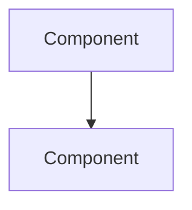

# SPEC: {{project_name}}

## 1. Overview
> 프로젝트/기능의 한 문단 요약

## 2. Goals & Non-Goals

### Goals
-

### Non-Goals
-

## 3. Architecture

## 4. Data Model

## 5. API / Interface

## 6. Acceptance Criteria
- [ ] AC1:
- [ ] AC2:
- [ ] AC3:

## 7. Implementation Plan
| Phase | 내용 | 산출물 |
|-------|------|--------|

## 8. Risks & Mitigations
| 리스크 | 확률 | 영향 | 대응 |
|--------|------|------|------|

## 9. References
- Brief:
- ADR:
